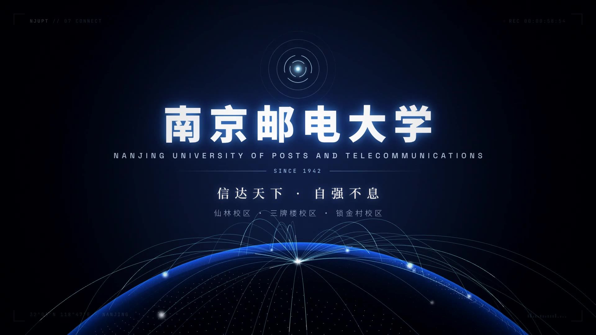

# 南京邮电大学 · NJUPT —— 动画宣传短片

一支约 1 分钟、1080p60 的动态图形短片，介绍南京邮电大学。整片由代码生成：画面用 HTML / Canvas / WebGL（three.js）逐帧渲染，配乐和音效用 numpy/scipy 从零合成，没有使用任何素材库、图片或音乐采样。

成片：[`video/NJUPT_1080p60.mp4`](video/NJUPT_1080p60.mp4)（61.5 秒，1920×1080，60 fps，H.264 + AAC）



## 分镜（128 BPM，画面与音乐按同一节拍网格对齐）

| 时间 | 段落 | 内容 |
| --- | --- | --- |
| 0:00–0:07 | 01 SIGNAL | 电报线上用摩尔斯电码敲出 `N J U P T`（每个嘀嗒对应一个音），逐字解码，信号收缩成一个光点 |
| 0:07–0:15 | 02 IDENTITY | 光点爆开，粒子汇聚成「南京邮电大学」；点阵星球从地平线升起，信号弧线从极点连向世界；「华夏IT英才的摇篮」 |
| 0:15–0:28 | 03 HISTORY | 光纤时间轴 + 滚动计数的年份：1942 → 1949 → 1958 → 2005 → 2017 → 2022，色调从烽火红过渡到信息蓝 |
| 0:28–0:41 | 04 STRENGTH | 跃迁穿梭；学科 3D 网络；“双一流”、ESI 前 1‰、6 个 ESI 前 1% 学科、27 个国家级一流本科专业建设点；柔性电子全国重点实验室 |
| 0:41–0:48 | 05 MOTTO | 校训「厚德 弘毅 求是 笃行」竖排书法，附典籍出处，钤印收尾 |
| 0:48–0:56 | 06 SPIRIT | 「信」的双重含义（诚信 / 信息），「信达天下 · 自强不息」逐拍落字 |
| 0:56–1:01 | 07 CONNECT | 片尾标版；最后用摩尔斯“AR”（报文结束符）收束 |

## 事实来源

片中涉及的史实与数据均来自学校公开资料（学校简介、南邮校史、学科建设办公室 ESI 动态等）：

- 1942 年诞生于山东抗日根据地的八路军战邮干训班；1949 年随军南下迁至南京；1958 年经国务院批准定名南京邮电学院；2005 年经教育部批准更名为南京邮电大学
- 2017 年入选国家首批“双一流”建设高校（建设学科：电子科学与技术），2022 年入选第二轮“双一流”建设高校
- 6 个学科进入 ESI 全球前 1%，计算机科学、工程学进入前 1‰（2025 年 5 月数据）；27 个国家级一流本科专业建设点
- 牵头组建柔性电子全国重点实验室
- 校训：厚德、弘毅、求是、笃行；南邮精神：信达天下、自强不息
- 校区：仙林、三牌楼、锁金村

本片为非官方作品，未使用学校校徽等官方标识。

## 自己构建

依赖：Node.js 18+、Python 3.10+（`pip install numpy scipy pillow fonttools brotli pyloudnorm imageio-ffmpeg`）、带 libx264 的 ffmpeg，以及 Playwright 自带的 Chromium。

```bash
npm install
npm run music                  # 生成 out/soundtrack.wav（先导出 out/cues.json）
npm run render                 # 逐帧渲染并与配乐合成 out/NJUPT.mp4
node tools/stills.mjs 12.0     # 渲染单帧预览
node tools/stills.mjs --sheet 0 8 0.5 intro   # 生成缩略图联系表
```

在浏览器里实时预览：在仓库根目录起一个静态服务器（如 `npx serve .`），打开 `/src/index.html`，点击画面可播放配乐。

修改了画面文字后需要重新子集化字体：`bash tools/fetch_fonts.sh && npm run fonts`。

## 目录

- `src/timeline.js` —— 总时间线：BPM、段落、摩尔斯时序、里程碑、所有音效的提示点
- `src/scenes/` —— 七个段落 + HUD，每个都是时间 `t` 的纯函数，任意帧可独立渲染
- `src/lib/` —— 缓动/随机数工具、Canvas 辉光与文字精灵、WebGL 图层、点阵星球
- `tools/render.mjs` —— 多进程无头 Chromium 逐帧截图 → ffmpeg 编码 → 合成音轨
- `tools/music.py` —— 合成器与编曲：超级锯齿 pad、琶音、贝斯、鼓组、太鼓、Karplus-Strong 古筝、摩尔斯电码、冲击与转场音效，母带响度 −14 LUFS

## 许可

- 代码：MIT
- 字体（均为 SIL Open Font License 1.1，已子集化）：Noto Sans SC、Noto Serif SC、Ma Shan Zheng、Space Grotesk、JetBrains Mono
- three.js：MIT（见 `src/vendor/three.LICENSE`）
